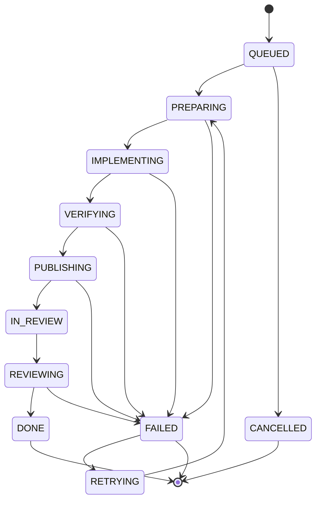
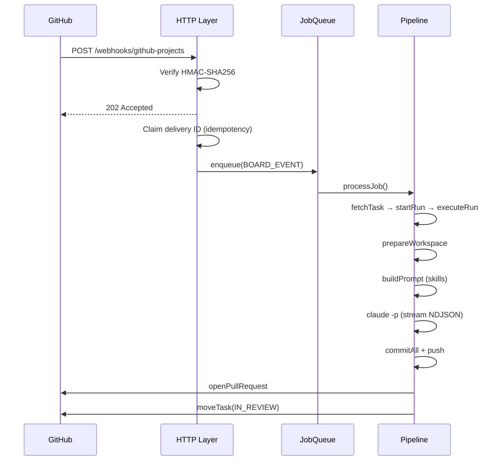
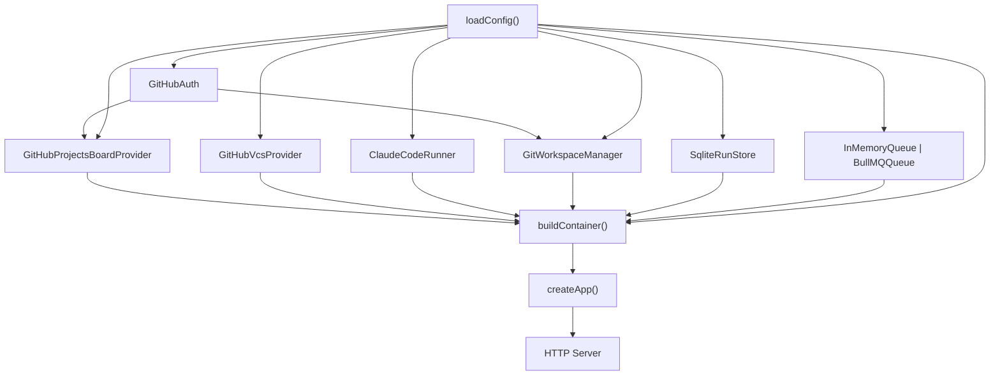

# Architecture

## Overview

Raccoon follows a hexagonal (ports & adapters) architecture. The domain has zero I/O; all external interactions are behind typed interfaces (ports) with concrete implementations (adapters) wired at startup.

## Package layout

```
raccoon/
├── packages/
│   └── core/                  # raccoon-core — the single deployable service
│       ├── src/
│       │   ├── domain/        # Pure domain: Run state machine, Task types, errors
│       │   ├── ports/         # TypeScript interfaces for all I/O
│       │   ├── adapters/      # Concrete implementations
│       │   │   ├── http/      # Express 5 API + webhook ingestion
│       │   │   ├── board/     # BoardProvider implementations
│       │   │   │   └── github-projects/
│       │   │   ├── vcs/       # VcsProvider implementations
│       │   │   │   └── github/
│       │   │   ├── agent/     # AgentRunner implementations
│       │   │   │   └── claude-code/
│       │   │   ├── workspaces/# WorkspaceManager (git worktrees)
│       │   │   ├── queue/     # JobQueue (in-memory, BullMQ)
│       │   │   └── store/     # RunStore (SQLite, in-memory)
│       │   ├── composition/   # Dependency injection / wiring
│       │   ├── pipeline/      # Task orchestration (10-stage run lifecycle)
│       │   ├── skills/        # Prompt templates + MCP materializer
│       │   ├── config/        # Env schema (Zod) + loader
│       │   └── shared/        # Logger, metrics, result type, IDs
│       ├── assets/prompts/    # Skill prompt templates (Markdown)
│       └── test/
│           ├── unit/
│           ├── integration/
│           ├── fakes/         # In-memory test doubles
│           └── contracts/     # Port contract tests
├── Dockerfile
├── docker-compose.yml
└── .github/workflows/ci.yml
```

## Run state machine



## Webhook flow



## Dependency injection


